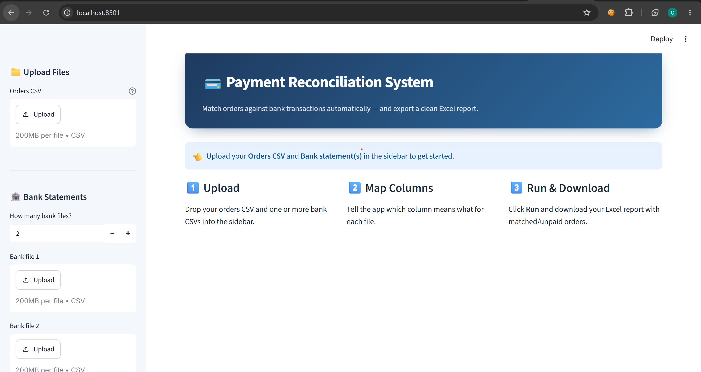

# Payment Reconciliation System

A tool that automatically matches customer **orders** against **bank payments**, so you
can instantly see which orders are paid, which are still unpaid, and which bank
payments don't correspond to any order.

## The problem it solves

Matching orders to bank payments by hand is slow and error-prone. What if you had a programm that you simply import the orders and the payments and instantly you get your paid and unpaid orders? 

I originally built this for a **real client** whose orders and bank statements are in
**German**. This tool automates the whole matching process and produces a clean report.

## Screenshot



## How it works

**Input files (orders and bank statements) must be in CSV format** The final report is in Excel(`.xlsx`)


1. **Inspect your files first.** Open your orders file and your bank file(s) and look at
   them — what columns they have, which separator they use (`,` or `;`), the encoding,
   and which columns you actually need.
2. **Tell the app about those columns.** There are two ways:
   - **Through the web app (recommended):** upload the files and pick the separator,
     encoding, and column mapping directly from the interface — no code editing.
   - **Through `configuration.py`:** for a programmatic run, edit the `CONFIG`
     dictionary (file paths, separators, encodings, column mappings, payment method).
3. **The system matches the data in two passes:**
   - **Exact match** — by receipt number / order id found in the bank transaction text.
   - **Fuzzy match** — by name + amount + date for payments without a usable number.
4. **You get the results:** matched orders, still-unpaid orders, and unmatched bank
   payments — plus a downloadable Excel report.

> Note: the project ships configured for a **German** client (German column names,
> `cp1252` encoding). For a different setup (for example English files), just update
> the column mappings, separator, and encoding in `configuration.py`.

## Tech stack

- **Python** — core language
- **pandas** — all the data loading, cleaning, and matching
- **Streamlit** — the web interface (upload files, see results, download report)
- **SQLAlchemy + SQLite** — memory of unpaid orders across runs (so a late payment in a
  later period can still be matched to an old order)
- **Docker** — containerized so it runs the same way anywhere
- **pytest** — tests for the core matching logic

## How to run

### Option 1 — Run locally

```bash
git clone <your-repo-url>
cd "Payment Reconciliation System"
pip install -r requirements.txt
streamlit run app.py
```

Then open **http://localhost:8501** in your browser.

### Option 2 — Run with Docker

```bash
docker build -t reconciliation .
docker run -d -p 8501:8501 -v reco_data:/app/data reconciliation
```

Then open **http://localhost:8501**.
(The `-v reco_data:/app/data` part keeps the unpaid-orders memory between runs.)

## Try it with sample data

Don't have your own files? The `sample_data/` folder has small, **fake** CSVs so you
can see the app working end to end:

1. Start the app (see *How to run*).
2. In the sidebar, upload:
   - **Orders CSV** → `sample_data/sample_orders.csv`
   - **Bank file 1** → `sample_data/sample_bank_ksk.csv`
   - **Bank file 2** → `sample_data/sample_bank_grenke.csv`
3. For the bank files, keep the defaults: separator `;` and encoding `cp1252`.
4. Click **Run Reconciliation**.

Expected result: **9 matched** orders (5 by receipt number, 1 by order id, 3 by
name + amount + date), **3 unpaid** orders, and **2 unmatched** bank payments. The
STRIPE, PayPal and AMAZON payouts are filtered out.

## What I built

I designed and built the core reconciliation engine myself:

- A **modular pipeline** split into clear stages — `loader`, `preprocess`, `processor`,
  `exporter` — orchestrated by `pipeline`.
- A **config-driven design**, so supporting a new client or bank means editing
  `configuration.py` instead of the code.
- A **two-pass matching algorithm**: an exact pass (receipt number / order id) followed
  by a fuzzy pass (name + amount + date).
- **German name normalization** (handling umlauts/accents) so names match reliably.
- **Schema validation** of the input columns, and a **multi-sheet Excel report**.

## About this project & what I learned

I built this project myself. I used **AI assistance (Claude)** for the Streamlit
interface — which I hadn't worked with before — and for debugging.

Through this project I learned to:

- **Solve architecture problems** — figuring out the right *order* of the steps so the
  pipeline gives the best result.
- **Choose the best matching strategies** for the real problem my client had.
- **Build a user-friendly interface** where the client just uploads files and gets the
  result back, with no technical knowledge needed.
- **Organize a project** so it stays readable, reusable (with only small changes for a
  new client), and doesn't turn into chaos.


